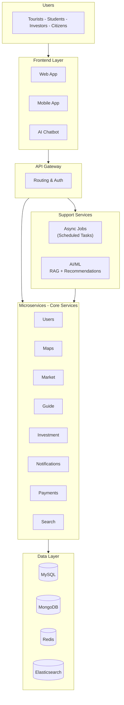
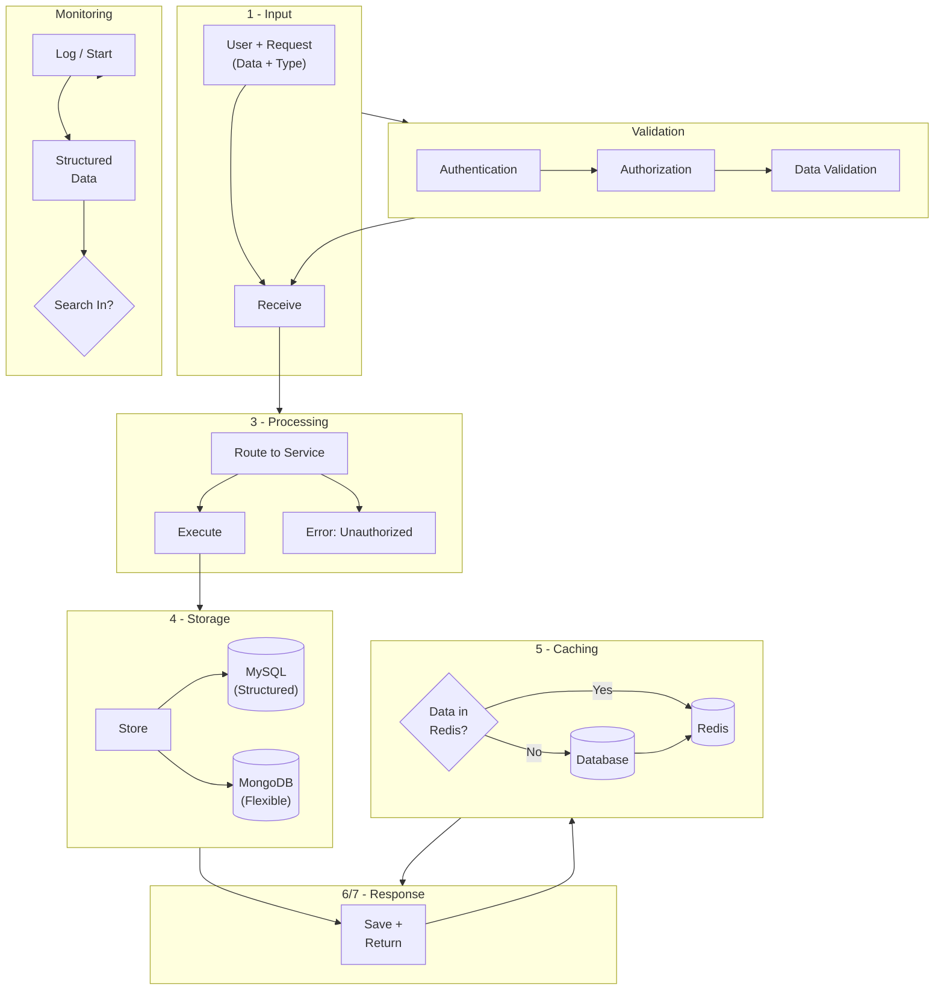

# Hackathon Project Proposal

# Hena Wadeena

(Hena Wadeena)

Slogan: The Valley... Closer Than You Imagine

|            |                              |
| ---------- | ---------------------------- |
| Team Name: | Dev-X                        |
| Hackathon: | New Valley Tech              |
| Track:     | Software                     |
| Date:      | 2026/2/6                     |
| Location:  | New Valley, Al-Kharga, Egypt |

hena-wadeena.lovable.app (POC) | 01012482107 | mhmod.mhmod01110@gmail.com

---

## 1. Executive Summary

Is it reasonable that Egypt's largest governorate has no digital gateway? New Valley Governorate suffers from scattered information, random pricing, and logistical complexity, which weakens investment opportunities, complicates the lives of incoming students, and diminishes the appeal of the tourism experience, amid weak data modernization and users' reliance on unreliable sources (such as scattered pages across social media platforms). Economic, tourism, and service decisions become fraught with risk, and enormous empowerment opportunities are lost due to the absence of a "unified platform" that aggregates data and services at a single access point.

The proposed solution is the "Hena Wadeena" platform, a unified digital portal aligned with Egypt's comprehensive digital services vision, serving as the digital bridge that connects the investor, the tourist, the student, and the local citizen to the heart of New Valley with the press of a button. The platform offers an integrated service package covering access to the governorate, internal mobility, product and service pricing, investment support, student services, tourism guidance, and smart interaction even under weak network conditions.

The main components of the platform include:

- **Wadeena Connects You:** An integrated system for linking with bus companies for transportation to and from our governorate, in addition to a Carpooling system to facilitate carpooling trips to and from our governorate.
- **Wadi Exchange:** A seasonal update of crop and product prices, with direct linkage between farmers, factories, and merchants in a B2B model to curb middlemen and enhance fair profit.
- **Investment Portal:** Connecting startups and youth ideas with external investors and converting initiatives into executable projects.
- **Al-Wahati Guide (Oasis Guide):** Verified accommodation for incoming students and an on-demand practical guide service, which increases reliability and reduces search time.
- **Imagine Chatbot:** A smart assistant in local dialect for responding to inquiries.

\* Target users represent four segments that constitute development pillars in New Valley:

- **Students, newcomers, and expatriates:** Providing reliable data on housing and services, reducing alienation, and improving quality of daily life.
- **Investors and entrepreneurs:** Increasing information transparency, reducing risks, supporting decision-making, and connecting capital with local opportunities.
- **Tourists:** Enabling smart trip planning and an integrated experience encompassing arrival, mobility, exploration, and discovering historical sites.
- **Local citizens:** Empowering them to access services and opportunities and supporting the local economy through a more transparent and connected marketplace.

\* The Business Model focuses on a multi-faceted platform that combines supply and demand:

- Commissions/subscriptions for B2B services within the Wadi Exchange (featured ads, merchant/factory subscriptions, documentation services).
- Optional service fees on transportation/guides/verified accommodation (booking, documentation, support).
- Partnerships with local entities (service providers, agricultural associations, tourism facilities, startups).
- Investor packages (opportunity pages, reports, optimized data access).

## 2. Problem

- **Information fragmentation:** New Valley data is scattered across outdated websites and social media pages, which reduces trust and ease of use.
- **Logistical obstacles:** Access to the governorate and internal mobility is unclear for tourists, students, and investors.
- **Market ambiguity:** There is no reliable reference that is regularly updated for strategic crop prices and supplier linkage.
- **Student and newcomer challenges:** Discovering housing and daily services is difficult to verify quickly and safely.

## 3. Proposed Solution: Hena Wadeena

### 3.1 Overview

A unified digital portal (ChatBot + Web Service) for New Valley supporting: transportation and access, local commodity exchange, tourism discovery, and student and newcomer services.

### 3.2 Core Modules

- **Access and Mobility:** How to reach New Valley + internal routes and movement.
- **Wadi Exchange:** A reference for strategic crops (dates, olives) + supplier directory.
- **Tourism Guide:** Selected places (heritage + modern), stories, trip programs.
- **Student and Newcomer Hub:** Verified housing + essential services + carpooling.
- **Smart Assistant "Imagine" (AI Concierge):** Directed information and instant answers using reliable sources.

### 3.3 User Journeys (for Mobilization)

- **Investor Journey:** [Search for opportunity - View exchange trends - Contact suppliers - Deal workflow]
- **Tourist Journey:** [Choose trip program - Transportation plan - Book guide - Offline access]
- **Student Journey:** [Verify housing - Compare options - Moving checklist - Carpooling]

## 4. Innovation and Differentiation

The "Hena Wadeena" platform is distinguished by combining public services and a unified digital identity for New Valley Governorate at a single access point, simulating Egypt's digital services, with practical integration of artificial intelligence and local data technologies to support decision-making and improve user experience.

- **Unified digital identity for the governorate:** The platform is not merely a service; it represents a formal digital entity whose appearance addresses information fragmentation and unifies data sources and services under a single, consistent brand.
- **Seasonal transparency and pricing:** Daily monitoring and updating (expandable to real-time) of commodity and product prices, which reduces market randomness and curbs manipulation, and helps investors, merchants, and citizens make data-driven decisions.
- **Multi-role smart assistant:** A Chatbot that supports inquiries, guidance, and navigation within the platform, simplifying information access in a style that suits users, with the ability to customize it for the local dialect and the most common usage scenarios.
- **Design tailored for diverse segments:** Platform services are designed to serve the needs of diverse demographic and community segments (students, tourists, investors, local citizens), with a clear interface and simplified usage experience that reduces digital friction.
- **Enhancing credibility through partnerships:** Adopting documentation and linkage mechanisms with local entities and companies (service providers, facilities, official data) to build trust, while leveraging available institutional/governmental support to ensure update sustainability and verification.

## 5. Target Users

- Investors and merchants (B2B)
- Tourists
- Students and newcomers
- Local residents

## 6. Personas (Summary)

### 6.1 The Strategic Investor ("Mr. Mahmoud", 45 years old, Cairo)

- **Needs:** Reliable data, clear opportunities, and direct access to suppliers.
- **Pain point:** Unreliable information, difficult local coordination.
- **Served via:** The Exchange + opportunity map + onboarding verified partners.

### 6.2 The Adventurous Tourist ("Salma", 24 years old, Alexandria)

- **Needs:** Access, accommodation, safe mobility, authentic experiences.
- **Pain point:** Unclear transportation and unreliable booking.
- **Served via:** Curated tourism guide + transportation clarity + local guide network.

### 6.3 The Resident Student ("Ahmed", 19 years old, Sharqia)

- **Needs:** Affordable verified housing, safety, community support.
- **Pain point:** Low-trust listings and an unfamiliar city.
- **Served via:** Verified housing + reviews + student hub + carpooling.

## 7. Value Proposition

1. **Unified official identity:** A single trusted portal.
2. **Market transparency:** An organized exchange + B2B matching.
3. **Reducing logistical friction:** Access, mobility, planning.
4. **Reliable student support:** Housing and essential services.

## 8. Business Model

### 8.1 Revenue Sources (for Mobilization)

- B2B matching commission: [percentage or fixed fees]
- Sponsored listings and ads: [per-ad pricing]
- Premium services: [housing facilitation, tourism guides, transportation]
- Data services (optional): [reports, company dashboards, data analysis and understanding indicators]

### 8.2 Cost Structure (for Mobilization)

- Development and hosting
- Data operations (verification, fieldwork)
- Marketing and partnerships
- Support and supervision

## 9. Marketing

### 9.1 Phases

We adopt a go-to-market strategy based on three interconnected phases: starting with building awareness and a strong narrative about New Valley, then shifting attention to interaction within the platform (content + smart assistant + collecting potential customers), then moving to the conversion phase through launching high-return services (the exchange, verified listings, partner onboarding).

1. **Phase One: Awareness (Awareness)**

   The goal is to deliver the platform concept to a large number of users inside and outside New Valley and build a clear mental image: "The Valley is closer than you imagine."
   - Launch a campaign titled "Discover New Valley" on social media platforms.
   - Short content illustrating real-world problems (information fragmentation/transportation/prices) and how the platform solves them.
   - Direct the user to a simple Landing Page for introduction and attracting interest.

2. **Phase Two: Collaboration & Engagement**

   The goal is to convert awareness into actual usage within the platform, build an ongoing relationship with the user, and form a database of potential customers and partners.
   - Activate the smart assistant to answer questions and guide the user to the shortest path to the service they need.
   - Publish interactive content (maps, routes, service directory, FAQs) encouraging return to the platform.
   - Capture Lead: Simplified registration for users + interest forms (investor/tourist/student).
   - Build an early partner network (housing providers, guides, suppliers, factories/merchants) and prepare the documentation mechanism.

3. **Phase Three: Full Digital Conversion**

   The goal is to convert users into real transactions within the platform, and launch services that achieve economic value and prove the project's viability.
   - Fully launch the Wadi Exchange (prices + linkage + B2B + offers/orders).
   - Launch verified listings (student housing, guides, tourism/logistics services) with clear documentation badges.
   - Formally onboard partners: service providers, local entities, youth initiatives, and link them to a governance dashboard for data lifting and updating.
   - Activate trust mechanisms and dispute resolution (clear policies + support + reviews) to increase reliability and sustain usage.

### 9.2 Key Performance Indicators (KPIs)

- **Awareness:** [Number of Reach/Impressions, website visits, brand name searches, conversion rate from campaign to landing page.]
- **Engagement:** [Number of daily/weekly active users, average session duration, smart assistant sessions, registration completion rate, retention rate (Retention).]
- **Conversion:** [Number of suppliers/partners, active users, number of offers/orders and deals, conversion rate to booking/order, customer acquisition cost (CAC) vs. customer lifetime value (LTV).]
- **Trust:** [User ratings, support response time, successfully closed complaint rate, number of dispute cases and their resolution, data accuracy/freshness (such as prices and listings).]

## 10. SWOT Analysis (Summary)

### 10.1 Strengths

- Minimal direct competition for a unified portal.
- High demand across investors, tourists, and students.
- Data foundation enables strong analytics and precise targeting.

### 10.2 Weaknesses

- Data collection and verification effort in the early stage.
- Connectivity limitations in remote areas.
- Need to build trust with official partners.

### 10.3 Opportunities

- Regional development and digitization agendas.
- Agricultural scope and export expansion opportunities.
- University partnerships for student services.

### 10.4 Threats

- Unreliable social media pages as entrenched competitors.
- Price volatility harms credibility without frequent updates.
- Cultural resistance to digital workflows.

## 11. Technical Overview

The "Hena Wadeena" platform aims to build on a Microservices architecture, where each core function of the platform is separated into independent services (navigation and maps, price exchange, investment portal, student guide and services, documentation and support, etc.). This approach ensures clear separation of responsibilities and improves the ability for incremental development without affecting the rest of the system.

AI services are also integrated as an independent layer within the system (such as the AI assistant and search and recommendation services), so that AI can be updated or its capabilities expanded without disrupting the core operational services of the platform.

This architecture provides practical advantages directly:

- **Scalability:** Each service can be scaled according to the load on it independently, which ensures better performance as the number of users and data grows.
- **Ease of Maintenance and Reliability:** Isolating faults and simplifying issue tracking and resolution quickly.
- **Speed of Adding Features:** Introducing new services or improving existing ones without rebuilding the entire system.
- **Government Integration Readiness:** Facilitating integration with official entities through clear programmatic interfaces (APIs) and access and authentication policies ready for expansion when institutional partnerships begin.

### 11.1 Technology Stack

Table 1: Suggested Technology Stack

| Layer                        | Suggested Technologies            |
| ---------------------------- | --------------------------------- |
| Web Frontend                 | HTML - JS - CSS                   |
| Backend APIs                 | Python/Node.js/Java FastAPI       |
| Database                     | MySQL/MongoDB                     |
| Cache                        | Redis                             |
| Search & Indexing            | Elasticsearch/Meilisearch         |
| Maps/Geo                     | Google Maps                       |
| AI/ML                        | System Recommendation + RAG + LLM |
| Async Jobs                   | Queue Task Celery                 |
| CI/CD                        | CI Actions/GitLab GitHub          |
| Observability and Monitoring | Prometheus/Grafana                |

### 11.2 System Architecture

The "Hena Wadeena" platform is built according to a Microservices architecture, where platform functions are separated into independent services (deployable and scalable independently), relying on clear programmatic interfaces (APIs). This design achieves high throughput under user load and rising request volumes (High Throughput), and ensures the platform continues to operate efficiently even under peak conditions, with the ability to maintain each component without affecting the rest of the system.

#### 11.2.1 Core Components

- **Frontend Layer:** An interactive web interface focused on ease of access to services (maps, navigation, prices, guide, investment), with multi-device support (mobile/desktop) and a simplified user experience.

- **API Gateway / Backend APIs Layer:** A unified entry point for user requests that routes requests to the appropriate microservice, applies authentication and access control policies (AuthN/AuthZ), and rate limiting when needed.

- **Microservices:** The platform is divided into domain-based services, such as:
  - **Users Service:** User accounts, roles, authentication, and permissions management.
  - **Maps and Navigation Service:** Routes, points of interest, integration with map services, and location data management.
  - **Market/Prices Service:** Entering crop prices, updating, verifying, tracking changes, and displaying them.
  - **Guide and Documentation Service:** Accommodation/guide/service listings, documentation mechanisms, and content management.
  - **Investment and Opportunities Service:** Displaying opportunities, investment proposal models, and linking startups with investors.
  - **Notifications Service:** Email/SMS/in-app notification messages for updates and alerts.
  - **Payments Service:** Integration with payment gateways, and managing invoices and financial operations when activating paid services.

- **Database Layer (Databases):** Using a SQL database for structured entities (such as users, transactions, authenticated listings) with the possibility of adding a NoSQL database for flexible/fast-changing data (such as price logs, events, usage sessions).

- **Caching Layer:** Relying on Redis to speed up responses and reduce pressure on databases, especially for high-demand data such as: current prices, authenticated listings, popular search results, and homepage content.

- **Search and Indexing:** A search engine (such as Elasticsearch or Meilisearch) for indexing listings and prices, locations and services, enabling fast search with suggestions (Autocomplete) and smart result ranking.

- **Async Jobs:** Running heavy or scheduled tasks outside the direct request path using Celery, such as:
  - Updating prices periodically and verifying their sources.
  - Re-indexing data in the search engine.
  - Generating reports and data dashboards for partner entities.
  - Sending bulk notifications and alerts.

- **AI/ML Services Layer:** Independent services that support the platform, such as:
  - **Chatbot:** For answering questions and guiding the user within the platform.
  - **RAG (Retrieval-Augmented Generation):** For searching trusted content (FAQs, procedures, tools) and returning precise answers.
  - **Recommendation System:** Ranking services/visits/listings/prices according to the user's interests and browsing behavior.

- **Observability:** Using Prometheus/Grafana to monitor performance, error rates, response times, and resource consumption, supporting stability, scalability, and fast response to any faults.

#### 11.2.2 Performance & Reliability

- **Handling Load Under Pressure:** The most heavily used services (such as prices, search, and maps) can be scaled independently without expanding the rest of the system.
- **Reducing Response Time:** Through Caching for frequently accessed data, and offloading heavy tasks to Async Jobs.
- **Improving Search Experience:** Through specialized indexing and result ranking that supports fast browsing and information access.
- **Institutional Scalability Readiness:** An architecture based on APIs and clear documentation and integration standards, facilitating linking with official entities and partners upon activation.

### 11.3 System Diagrams

Figure 1: "Hena Wadeena" Platform System Architecture - Complete Architecture

#### 11.3.1 Diagram Explanation

Figure 1 illustrates the complete architecture of the "Hena Wadeena" platform, which consists of six main interconnected layers:

**First Layer: Users (Users Layer)** — This layer represents the target user segments of the platform:

- **Tourists:** Searching for tourism information, transportation, and accommodation services.
- **Students:** Newcomers for study who need reliable housing and daily services.
- **Investors:** Looking for investment opportunities and trusted market data.
- **Local Citizens:** Benefiting from available services and opportunities.

**Second Layer: Frontend Layer** — This represents the entry points for users and consists of three main interfaces:

- **Web Application:** An interactive browser-based interface that provides a full user experience with multi-device support.
- **Mobile Application:** An optimized interface for smartphones that provides ease of access and use on the go.
- **AI Chatbot:** A smart conversational interface that helps the user access information and services quickly, with support for local dialect and offline functionality in appropriate conditions.

**Third Layer: API Gateway** — This layer acts as a unified entry point for all incoming requests from the interfaces, performing the following tasks:

- **Authentication & Authorization:** Verifying the user's identity and permissions before allowing access to services.
- **Routing:** Directing each request to the appropriate microservice based on the type of operation requested.
- **Rate Limiting:** Protecting the system from excessive use and ensuring fair resource distribution.
- **Error Handling:** Processing errors in a unified manner and returning clear messages to the user.

**Fourth Layer: Microservices Layer** — This is the heart of the system, consisting of independent units, each responsible for a specific functional domain:

1. **Users Service:** Managing user accounts, permissions, and personal profiles.
2. **Maps Service:** Providing interactive maps, access routes to new valleys, internal navigation, with Carpooling system support.
3. **Market Service:** Managing crop and strategic product prices (dates, olives), and linking farmers with manufacturers and traders via B2B plans.
4. **Guide Service:** Managing authenticated listings for accommodation, guides, and tourism services, with verification and documentation mechanisms.
5. **Investment Service:** Displaying investment opportunities, linking startups with investors, and managing funding requests.
6. **Notifications Service:** Sending alerts and messages to users via email, SMS, or in-app push notifications.
7. **Payments Service:** Processing financial transactions, integrating with payment gateways, and managing invoices and subscriptions.
8. **Search & Index Service:** Providing fast and accurate search across all platform content, with smart suggestions and relevance-based ranking.

Advantages of the microservices architecture:

- **Independence:** Each service can be developed and deployed independently without affecting other services.
- **Scalability:** Each service can be scaled according to demand (such as scaling the market service during peak seasons).
- **Ease of Maintenance:** Isolating faults in one service without disrupting the entire system.
- **Technology Flexibility:** Each service can be built with the technology most suitable for it.

**Fifth Layer: Support Services** — This layer provides supporting services that work alongside the core services:

- **AI/ML Services:**
  - **RAG (Retrieval-Augmented Generation):** For searching trusted content and providing precise answers via the AI assistant.
  - **Recommendation System:** For suggesting services, visits, and the most suitable opportunities for each user based on their interests and behavior.
  - **Text Analysis:** For understanding user queries and improving answer quality.

- **Async Jobs (Celery & Cron):**
  - **Price Updates:** Collecting and updating crop and product prices periodically (seasonal or monthly).
  - **Sending Bulk Notifications:** Sending messages to users without delaying other requests.
  - **Report Generation:** Generating periodic reports for companies and investors.
  - **Re-indexing:** Updating the search engine with new data.
  - **Backup:** Backing up data periodically to ensure safety.

**Sixth Layer: Data Layer** — This consists of diverse storage systems, each optimized for a specific type of data:

- **MySQL (Relational Database):**
  - Storing structured data that requires clear relationships (users, transactions, reservations).
  - Ensuring data integrity (ACID Compliance) for financial and sensitive operations.
  - Suitable for complex queries and reports.

- **MongoDB (Flexible Database):**
  - Storing unstructured or variable-schema data (map locations, event logs).
  - High flexibility in development and expansion.
  - High performance for concurrent read and write operations.

- **Redis (Cache):**
  - Storing the most frequently requested data in memory to speed up responses (current prices, popular listings).
  - Reducing load on primary databases by up to 80%.
  - Managing sessions and temporary authentication.

- **Elasticsearch (Search and Indexing Engine):**
  - Indexing all content (services, visits, listings, opportunities) for fast and effective search.
  - Full-Text Search support with relevance-based ranking.
  - Autocomplete suggestions while typing.

**Additional Layer: Monitoring** — Although it is not part of the core data flow, this layer is essential for ensuring system stability:

- **Prometheus:** Collecting live metrics (Rate, Error Time, Response Memory, CPU).
- **Grafana:** Displaying interactive data dashboards for monitoring system performance.
- **Automatic Alerts:** Notifying the technical team when problems occur or allowed thresholds are exceeded.

#### 11.3.2 Data Flow in the System

To understand how the platform works in practice, we present an example of a complete user journey:

**Example: A tourist searching for a tour guide**

1. **Entry:** The tourist opens the web application on their phone.
2. **Query:** They type in the search bar: "tour guide in Al-Kharga."
3. **Routing:** The request passes through the API Gateway, which verifies the user's identity (if registered) and routes the request to the search service.
4. **Search:** The search service queries Elasticsearch for authenticated guides in Al-Kharga.
5. **Recommendation:** The AI/ML system ranks the results based on user ratings, distance, and specialization.
6. **Caching:** The results are stored in Redis for a short duration to speed up similar requests.
7. **Display:** The results are presented to the tourist with photos, ratings, and guide prices.
8. **Booking:** When selecting a guide, a booking request is created in MySQL via the guide service.
9. **Notification:** The notifications service sends an alert to the tour guide via an asynchronous job (Async Job).
10. **Confirmation:** The tourist receives a confirmation message via email and the application.

**Important note:** This example illustrates how all layers work together harmoniously to deliver a smooth user experience, while complex operations are processed in the background without the user feeling any complexity.

#### 11.3.3 Technical Advantages

1. **High Performance:**
   - Using Redis reduces response time by 70-80% for frequently accessed data.
   - Horizontal distribution of microservices allows serving thousands of users simultaneously.

2. **Flexible Scalability:**
   - The market service can be scaled independently during harvest seasons without expanding other services.
   - Vertical scaling (increasing server resources) or horizontal scaling (increasing the number of servers) as needed.

3. **Reliability:**
   - Fault isolation: A problem in the payments service does not affect the maps service.
   - Automatic backups ensure no data loss.

4. **Security:**
   - The API Gateway layer provides a centralized control point for authentication and permissions.
   - Encryption of sensitive data (user information and payments).
   - Access monitoring and DDoS protection (Protection DDoS Limiting, Rate).

5. **Maintainability:**
   - Each service has an independent team that can develop without coordinating with other teams.
   - Easy to track bugs and resolve them quickly thanks to isolation and monitoring.

6. **Institutional Integration Readiness:**
   - Documented and clear programmatic interfaces (APIs) for linking with government entities.
   - High security standards compliant with official requirements.
   - Ability to add new services (such as integration with the government payment system).

#### 11.3.4 Technical Roadmap

**Phase One (MVP - Minimum Viable Product):**

- Launch core services: Users, Maps, Market, Guide.
- Simple web interface and initial AI assistant.
- Single database (MySQL) with Redis for caching.

**Phase Two (Expansion):**

- Add investment and payments services.
- Full mobile application.
- Enhance the AI assistant with a RAG system.
- Add MongoDB and Elasticsearch.

**Phase Three (Maturity):**

- Advanced recommendation system.
- Integration with government entities.
- Advanced data analytics.
- Geographic expansion to other governorates.

### 11.4 Data Flow Diagrams

This section illustrates the complete journey of data within the "Hena Wadeena" platform, from the moment the user inputs a request until they receive a response, with a focus on validation, storage, and retrieval mechanisms that ensure data integrity and response speed.

_Figure 2: Data flow — Input, Validation, Processing, Storage, and Retrieval_

#### 11.4.1 Key Data Flow Phases

As shown in Figure 2, every request entering the platform passes through seven fundamental phases, each designed to ensure security, accuracy, and optimal performance.

**Phase One: Input** — Goal: Receive the request from the user and analyze it to determine the type of operation required.

Steps:

1. **The user sends a request:** Via the interface (web, mobile, or AI assistant), the user enters data or requests a specific service.
2. **Data reception:** The request arrives at the Frontend layer, which assembles the necessary data.
3. **Request type analysis:** Determine the type of operation (search, booking, price inquiry, adding content, etc.) to route it to the correct path.

Examples of inputs:

- A student searching for housing in Al-Kharija
- An investor inquiring about plot prices
- A tourist booking a tour guide
- A farmer adding a new listing on the exchange

**Phase Two: Validation** — Goal: Ensure that the request is secure, authorized, and valid before processing.

This phase is critical for protecting the system from harmful or unauthorized requests, and it consists of three security layers:

**1. Authentication:**

- Verify the user's identity using a Token or Session.
- On failure: The request is immediately rejected with an "Unauthorized" message (Unauthorized 401).
- On success: Proceed to the next layer.

**2. Authorization:**

- Confirm that the user has the permission to execute the requested operation.
- Example: A regular user cannot delete exchange listings, whereas a supplier or supervisor can.
- On failure: Reject with a "Forbidden" message (Forbidden 403).

**3. Data Validation:**

- Verify that the submitted data conforms to the required standards (data type, length, format).
- Data Sanitization to prevent injection attacks (XSS Injection, SQL).
- On failure: Reject with an explanatory error message.
- On success: Proceed to the processing phase.

**Practical example:**

When an investor attempts to add a purchase offer for dates:

- **Authentication:** Is the user logged in?
- **Authorization:** Does the user have an active investor account?
- **Data validation:** Is the price a positive number? Is the quantity logical? Is the date correct?

**Phase Three: Processing** — Goal: Execute the core business logic of the requested operation.

Steps:

1. **Routing to the appropriate service:** Based on the request type, it is routed to the designated specialized microservice:
   - Search request — Search Service
   - Housing booking — Directory Service
   - Price inquiry — Exchange Service
   - Adding content — Content Service

2. **Executing the Business Logic:**
   - The service performs the necessary computational or logical operations.
   - It may communicate with other services if needed (e.g., the Payments Service communicates with the Users Service).

3. **Determining the need for storage:**
   - If the operation requires saving new data or updating existing data — proceed to the storage phase.
   - If the operation is read-only — proceed directly to the retrieval phase.

**Phase Four: Storage** — Goal: Save data in the appropriate database securely and permanently.

Database selection mechanism:

The platform uses a Polyglot Persistence approach, i.e., using multiple storage systems according to the nature of the data:

**1. Structured Data — MySQL:**

- User data (accounts, permissions)
- Financial transactions (invoices, payments)
- Complex relationships between entities
- Need for transaction integrity guarantees (ACID Transactions)

**2. Flexible Data — MongoDB (Unstructured/Semi-structured):**

- Event Logs
- Geographic data (coordinates, routes)
- Diverse user content (reviews, comments)
- Rapidly changing or evolving data

Storage steps:

1. Determine the appropriate database based on data type.
2. Execute the save/update operation.
3. **Transaction Commit:** Ensure data was saved successfully before proceeding.
4. Trigger asynchronous tasks if needed:
   - Send notifications to relevant parties
   - Re-index data in the search engine
   - Create a backup copy

Security guarantees:

- **Automatic backup:** Periodic copying of sensitive data.
- **Encryption:** Encrypting sensitive data (passwords, payment information).
- **Rollback on failure:** In case of a save failure, an automatic Rollback is performed.

**Phase Five: Caching** — Goal: Speed up responses for repeated requests and reduce load on databases.

Operating mechanism:

1. **Identify data suitable for caching:**
   - High-demand data (today's prices, popular listings)
   - Rarely changing data (visit information, service directory)
   - Results of complex queries that consume time

2. **Store in Redis:**
   - Data is stored In-Memory for outstanding access speed.
   - Data is stored as Key-Value Pairs.

3. **Set expiration time (TTL - Time To Live):**
   - Prices: 10-30 minutes (depending on update frequency)
   - Listings: 1 hour
   - Semi-static data: 24 hours
   - After expiration, data is automatically deleted to ensure a fresh copy is obtained.

Benefits:

- Reduce response time from hundreds of milliseconds to less than 10 milliseconds.
- Reduce load on MySQL/MongoDB by 70-80%.
- Noticeably improve user experience.

**Phase Six: Retrieval** — Goal: Obtain the requested data in the fastest possible way.

Multi-level retrieval strategy:

**1. First level: Cache-First:**

- The first step is to search in Redis.
- If data is found (Cache Hit): Return it immediately.
- Response time: 5-10 milliseconds.

**2. Second level: Database Fallback:**

- If data is not found in cache (Cache Miss):
- Query the primary database (MongoDB / MySQL).
- Response time: 50-200 milliseconds.
- **Cache update:** After reading, the data is saved in Redis for subsequent requests.

**3. Aggregating results:**

- In some cases, data is aggregated from multiple sources.
- Example: A tour guide display page requires:
  - Guide data (MySQL)
  - Nearby visits (MongoDB)
  - Reviews and ratings (Redis/MongoDB)

**4. Formatting the response:**

- Convert data to the required format (typically JSON).
- Hide sensitive data (such as passwords).
- Add Metadata such as query time and number of results.

Performance optimizations:

- **Indexing:** Create indexes on frequently queried columns to speed up searches.
- **Optimized queries:** Avoid unnecessary complex queries.
- **Lazy Loading:** Load data only when needed.

**Phase Seven: Response** — Goal: Send the result to the user while logging the activity for monitoring and analysis.

Final steps:

**1. Send the response to the user:**

- Data is sent via the same channel through which the request arrived (HTTP Response).
- Add the appropriate status codes:
  - OK: 200 — Request succeeded
  - Created: 201 — New resource created
  - Bad Request: 400 — Error in data
  - Unauthorized: 401 — Not authorized
  - Error: Server Internal 500 — Server error

**2. Logging:**

- Save request details: user, operation type, time, result.
- Log errors and warnings for technical team review.
- Create a unique Request ID to trace the request across all services.

**3. Monitoring and analysis:**

- Send metrics to Prometheus: response time, success/failure rate.
- Update Grafana dashboards with live data.
- Trigger alerts if metrics exceed allowed thresholds.

#### 11.4.2 Asynchronous Operations

Some operations do not need to be executed in real time and can be deferred to avoid delaying the response to the user:

- **Sending notifications:** Email, text messages, in-app notifications
- **Re-indexing:** Updating Elasticsearch with new data
- **Report generation:** Periodic reports for partners and investors
- **Analytics:** Processing data to extract insights and statistics
- **Backups:** Periodic copying of sensitive data

Execution mechanism:

These tasks are managed via Celery Task Queue, where tasks are placed in a queue and processed gradually by Workers, independently, which maintains the core system performance.

#### 11.4.3 Continuous Monitoring

Throughout the request lifecycle, all phases are monitored to ensure:

- **Performance:** Measuring response time and identifying Bottlenecks.
- **Errors:** Detecting errors and tracing their causes.
- **Security:** Detecting intrusion attempts or suspicious usage.
- **Resources:** Monitoring consumption of Disk, Memory, CPU for scaling when needed.

#### 11.4.4 Full Applied Example

Scenario: A student searching for housing in Al-Dakhila.

1. **Input:** The student types "student housing in Al-Dakhila" in the search bar.
2. **Validation:**
   - Authentication: The student is logged in.
   - Authorization: They can search.
   - Data validation: The text is valid.
3. **Processing:** The request is routed to the Search and Directory Service.
4. **Storage:** The search log is saved in MongoDB (for analyzing student trends later).
5. **Caching:** Popular results are pre-stored in Redis.
6. **Retrieval:**
   - Search in Redis — found cached results.
   - Retrieve the list of verified housing in Al-Dakhila (10 results).
   - Format results: Add images, reviews, prices.
7. **Response:** Display the list to the student within 15 milliseconds.
8. **Asynchronous tasks:**
   - Log the search operation for analytics.
   - Update view counts for each housing option.

**Result:** A fast and smooth experience for the student, with data accuracy and security ensured in the background.

#### 11.4.5 Summary

The data flow diagram reflects the robust design of the platform that balances:

- **Security:** Through multiple validation layers.
- **Performance:** Through caching and smart retrieval.
- **Reliability:** Through secure storage and backups.
- **Scalability:** Through task separation and load distribution.

This architecture ensures that the platform can serve thousands of users simultaneously while maintaining service quality and data integrity.

## 12. Implementation Plan

At this stage, the platform is built as a Minimum Viable Product (MVP) focusing on: unifying core data, maps and navigation, the price exchange, and student services, with the addition of the AI assistant and support.

## 13. Team

The "Hena Wadeena" team consists of four members who combine technical expertise, product building, and the business side, ensuring the ability to execute the platform (MVP), operate, and grow it, in addition to formulating a viable business model.

- **Mahmoud Ahmad Shawqi** — (Team Leader, AI Engineer, Data Quality and Assurance):
  Team leader and responsible for developing the AI models used by the platform, integrating them with each other and with all services the platform provides, in addition to analyzing and processing data obtained through data collection operations.

- **Taher Mahmoud Sayed** — (Software Engineer, PM, Data Collection and Assurance):
  Responsible for designing the Backend of the project, designing and managing databases, and cloud services (Cloud Services).

- **Abd al-Rahman Mahmoud Shawqi** — (UI/UX Designer & Data Researcher):
  Responsible for:
  - Designing user interfaces and Wireframes & Prototypes with a focus on Usability to suit all age groups in the Wadi.
  - Data collection: Building the Initial Seed Data by surveying the most important housing providers, tourist attractions, and current crop prices to ensure a realistic experience at launch.
  - User experience: Ensuring the smoothness of the User Journey and alignment of the design with the new Wadi visual identity.

- **Samar Talaat** — (Business Development & Strategic Growth):
  Responsible for formulating and engineering the Business Model to ensure sustainability and growth. She brings her technical background and experience in global innovation (NASA & ISEF) to:
  - Strategic planning: Mapping the Go-to-Market Strategy and analyzing market gaps.
  - Market data analysis: Studying user segments accurately to ensure product alignment with real market needs.
  - Institutional partnership management: Building a strategic network of relationships with technical and mature entities to support project expansion.
  - Performance measurement and growth: Setting KPIs to ensure efficient achievement of project goals, both technically and commercially.

## 14. Budget & Requirements

Our needs at this stage focus on launching a usable MVP, then expanding it gradually based on data and adoption, as follows:

- **Infrastructure & Hosting:**
  Servers for operation (APIs + database + cache + search), a Domain and SSL certificates, and setting up a stable, scalable deployment environment.

- **UI/UX Design:**
  Designing clear and consistent interfaces that reflect the unified governorate identity, and improving the user experience for different segments (students/tourists/investors/citizens).

- **Field Validation & Data Verification:**
  Collecting data from trusted sources, documenting housing listings, services, and guides, and implementing mechanisms for reviewing prices and data to ensure credibility and continuous updates.

- **Community & Marketing:**
  Producing compelling content, managing social media platforms, targeted outreach campaigns to reach target segments, and building an early partner network (suppliers/guides/service providers/traders).

- **Services & Tools:**
  Analytics tools, email and notifications, Monitoring/Observability performance monitoring tools, and supporting services (such as Maps APIs, and payment gateways when activated).

- **AI Runtime Costs:**
  The cost of running AI assistant/knowledge retrieval models, Vector Index storage, and continuous evaluation and improvement operations.

The outputs of this budget include: Launching an MVP version, preparing a partner control dashboard, activating search and indexing, building a documentation foundation, and user experience testing — ready for expansion and receiving institutional integrations later.

## 15. Risks & Mitigation

Risks and threats include digital competition from free service pages, the emergence of alternative platforms, credibility challenges in case of delayed price/document updates, weak digital infrastructure in rural roads and remote areas, internet instability, and initial funding constraints that may slow the launch of supplementary services. To address this, the platform focuses on documentation, proactive updates, data verification mechanisms, and offline working options whenever necessary.

## 16. Expected Impact

The expected impact lies in improving the efficiency of access to information and services, increasing price transparency and reducing manipulation, boosting tourism and investment activity, and reducing the time and effort spent by students and residents. These indicators are preliminary targets based on reading the current gaps in the governorate and comparing them with the impact of similar unified digital solutions. Actual results may vary depending on implementation conditions and the rate of adoption and usage.

## 17. Appendices
