# Hena Wadeena - MVP Architecture & Roadmap

## Context

Hena Wadeena is a unified digital platform for New Valley Governorate, Egypt. The project has detailed specs (31 entities, 127+ endpoints, 8 roles) but zero backend implementation. A React frontend exists in a separate repo (`hena-wadeena-frontend/`) with 35+ Arabic RTL pages running against a Python mock server — **not yet connected to any real backend**. This plan covers the full MVP: backend microservices, API gateway, frontend-backend integration, and deployment.

**This is an overview plan** — it defines architecture, task dependencies, and parallelism. Detailed implementation specs for each task will be broken down as work begins. The plan includes both backend tasks (T01-T34) and frontend integration tasks (F00-F14) that run in parallel without extending the critical path.

**Key constraints:**

- 4 developers (NestJS × 3, Python/AI × 1)
- Service ownership: whoever starts a service, owns it (see [Task Ownership](#task-ownership))
- Frontend exists (React, separate repo) — moved into monorepo at `apps/web/` in F00
- AWS deployment already available
- Gemini Flash Lite 3.1 (chat) + Gemini Embedding 001 (vectors)

---

## Tech Stack

| Layer                | Technology                                                                                                   |
| -------------------- | ------------------------------------------------------------------------------------------------------------ |
| **Runtime**          | Node.js 22 LTS                                                                                               |
| **Framework**        | NestJS 11 (backend services) / FastAPI (AI service)                                                          |
| **ORM**              | Drizzle ORM                                                                                                  |
| **Database**         | PostgreSQL 16 + PostGIS (single database, per-service schemas on single instance)                            |
| **Cache/Events**     | Redis 7 (shared, key-prefix isolated; Streams for async events)                                              |
| **Vector DB**        | Qdrant                                                                                                       |
| **LLM**              | Gemini Flash Lite 3.1                                                                                        |
| **Embeddings**       | Gemini Embedding 001                                                                                         |
| **Auth**             | JWT (access + refresh tokens)                                                                                |
| **Password Hashing** | `@node-rs/argon2` (Argon2id, Rust/NAPI — no node-gyp, OWASP recommended)                                     |
| **Email**            | Resend (`resend` npm) — transactional OTP + password reset. Free tier: 3k/mo permanent                       |
| **Validation**       | Zod + `nestjs-zod` + `drizzle-zod` — single source of truth: Drizzle schema → Zod DTO → NestJS pipe          |
| **Logging**          | `nestjs-pino` + `pino-http` — JSON stdout, async writes, request ID auto-propagated via AsyncLocalStorage    |
| **Primary Keys**     | UUID v7 (`uuidv7` npm) via Drizzle `$defaultFn` — time-sortable, monotonic ordering guaranteed               |
| **Rate Limiting**    | Nginx (IP-level) + `@nestjs/throttler` (per-user/per-route) + Redis storage for multi-instance               |
| **File Uploads**     | AWS S3 presigned PUT URLs (`@aws-sdk/s3-request-presigner`) — browser uploads directly, server generates URL |
| **Health Checks**    | `@nestjs/terminus` + Docker `HEALTHCHECK` — required baseline                                                |
| **API Docs**         | Skipped for MVP (Zod/Swagger integration too costly at 127+ endpoints; add post-hackathon)                   |
| **Frontend Routing** | React Router v7 (upgrade from v6 — non-breaking, 15% smaller bundle; do not migrate to TanStack Router)      |
| **File Storage**     | AWS S3                                                                                                       |
| **API Gateway**      | Nginx                                                                                                        |
| **Containerization** | Docker + Docker Compose                                                                                      |
| **CI/CD**            | GitHub Actions                                                                                               |
| **Testing**          | Vitest + Supertest (NestJS) / pytest (Python)                                                                |
| **Monorepo**         | pnpm workspaces (NestJS) + uv (Python AI service)                                                            |
| **Orchestration**    | Docker Compose (unifies all services regardless of language)                                                 |

---

## Architecture: 7 Microservices

Original 13 services merged to 7 for a 4-person team:

```
                              ┌─────────────────────┐
                              │    React Frontend    │
                              │   apps/web/ (F00)    │
                              └──────────┬──────────┘
                                         │
                              ┌──────────▼──────────┐
                              │   Nginx Gateway     │
                              │   :8000             │
                              │   - SSL termination │
                              │   - Rate limiting   │
                              │   - Route proxying  │
                              │   - Block /internal │
                              └──┬──┬──┬──┬──┬──┬──┘
                                 │  │  │  │  │
         ┌───────────────────────┘  │  │  │  └───────────────────────┐
         │            ┌─────────────┘  │  └─────────────┐            │
         ▼            ▼                ▼                ▼            ▼
┌────────────┐ ┌────────────┐ ┌────────────┐ ┌────────────┐ ┌────────────┐
│  Identity  │ │   Market   │ │   Guide-   │ │    Map     │ │     AI     │
│  Service   │ │  Service   │ │  Booking   │ │  Service   │ │  Service   │
│  :8001     │ │  :8002     │ │  :8003     │ │  :8004     │ │  :8005     │
│            │ │            │ │            │ │            │ │            │
│ NestJS     │ │ NestJS     │ │ NestJS     │ │ NestJS     │ │ FastAPI    │
│ Auth+Users │ │ Listings   │ │ Guides     │ │ POIs       │ │ RAG Chat   │
│ KYC+Roles  │ │ PriceIndex │ │ Bookings   │ │ Carpool    │ │ KB Mgmt    │
│ Notifs     │ │ BizDir     │ │ Packages   │ │ Routes     │ │ Semantic   │
│ SavedItems │ │ Reviews    │ │ Reviews    │ │            │ │ Search     │
│            │ │ Opportun.  │ │            │ │            │ │            │
│            │ │ EOI/Apps   │ │            │ │            │ │            │
└─────┬──────┘ └─────┬──────┘ └─────┬──────┘ └─────┬──────┘ └─────┬──────┘
      │               │              │              │              │
      ▼               ▼              ▼              ▼              ▼
┌──────────────────────────────────────────────────────────────────────────────────────┐
│                              wadeena_db (PostgreSQL 16)                              │
│  ┌──────────┐ ┌──────────┐ ┌──────────────┐ ┌────────┐ ┌──────────┐                │
│  │ identity │ │  market  │ │guide_booking │ │  map   │ │    ai    │                │
│  │  schema  │ │  schema  │ │   schema     │ │ schema │ │  schema  │                │
│  └──────────┘ └──────────┘ └──────────────┘ └────────┘ └──────────┘                │
│  Extensions: PostGIS, pg_trgm (database-level)                                      │
└──────────────────────────────────────────────────────────────────────────────────────┘
                                                                              Qdrant
                        ┌─────────────────┐
                        │  Redis (shared) │   ← Streams events + cache
                        └─────────────────┘
                        ┌─────────────────┐
                        │  AWS S3         │   ← file uploads from any service
                        └─────────────────┘
```

### Service Ownership

| Service                                   | Entities                                                                                        | Endpoints | PostGIS | Backend Tasks                                | Frontend Tasks               |
| ----------------------------------------- | ----------------------------------------------------------------------------------------------- | --------- | ------- | -------------------------------------------- | ---------------------------- |
| **Identity** (auth+user)                  | User, UserKYC, UserPreferences, SavedItem, AuthToken, OTPCode, AuditEvent, Notification         | 20        | No      | T05, T09, T13, T20, T24                      | F02, F07, F09                |
| **Market** (listings+exchange+investment) | Listing, PriceSnapshot, BusinessDirectory, Review, InvestmentOpportunity, InvestmentApplication | 21        | Yes     | T03, T06, T10, T14, T17, T22, T26, T30       | F04                          |
| **Guide-Booking**                         | Guide, TourPackage, Booking, GuideAvailability, Review                                          | 20        | Yes     | T04, T07, T11, T15, T18, T27, T31            | F03, F06                     |
| **Map** (POI+carpool)                     | PointOfInterest, CarpoolRide, CarpoolPassenger                                                  | 8         | Yes     | T21                                          | F05                          |
| **AI** (Python)                           | ChatSession, KnowledgeBaseDocument                                                              | 6         | No      | T02, T02a, T08, T12, T16, T19, T23, T28, T32 | F08                          |
| **Shared**                                | —                                                                                               | —         | —       | T01, T25, T29, T33, T34                      | F00, F01, F11, F12, F13, F14 |

### Inter-Service Communication

**Sync (REST, internal Docker network):**

- Any service → Identity: `GET /internal/users/:id` (fetch user public profile)
- Unified Search (via Identity) → All services: `GET /internal/search?q=...`
- Gateway → Identity: `GET /internal/validate-token` (auth subrequest)
- All `/internal/*` routes blocked from external access by Nginx

**Async (Redis Streams + consumer groups):**

Events are published via XADD and consumed via XREADGROUP with per-service consumer groups. Unlike Pub/Sub, Streams persist messages — if a service is down during publish, it reads from its last acknowledged offset on restart. No events are silently lost.

- `user.registered` → AI (personalization)
- `listing.created` / `listing.verified` → AI (KB update)
- `booking.requested/confirmed/cancelled/completed` → Identity (notifications)
- `review.submitted` → Identity (notifications)
- `opportunity.published` → AI (KB update)
- `poi.approved` → AI (KB update)
- `kb.rebuild.requested` → AI (full re-index)

---

## Monorepo Strategy

**Pragmatic polyglot monorepo:** pnpm workspaces manage the NestJS ecosystem (4 services + 2 shared packages). The Python AI service lives in the same repo but is **not** a pnpm workspace member — it has its own `pyproject.toml` + `uv` lockfile. Docker Compose is the real unifier that orchestrates all services regardless of language.

**Why this works:**

- pnpm workspaces do what they're good at: shared TypeScript code (`@hena-wadeena/types` + `@hena-wadeena/nest-common`), consistent deps across NestJS services
- Python AI service is independent until Layer 6 (T28) — no shared code with NestJS services
- Docker Compose starts everything: NestJS, FastAPI, Postgres, Redis, Qdrant — language doesn't matter at container level
- No need for heavy polyglot tools (Nx, Bazel, Pants) at this team size

### Directory Structure

```
hena-wadeena/
├── docker-compose.yml
├── docker-compose.dev.yml
├── .env.example
├── pnpm-workspace.yaml              # packages/*, services/*, apps/*
├── package.json                      # Root: shared scripts, devDeps
├── apps/
│   └── web/                          # @hena-wadeena/web — React frontend (from hena-wadeena-frontend/)
│       ├── package.json              # depends on @hena-wadeena/types (NOT @hena-wadeena/nest-common)
│       ├── vite.config.ts            # proxy /api → :8000, port 8080
│       └── src/
│           ├── services/api.ts       # Central API client — imports types from @hena-wadeena/types
│           ├── contexts/             # AuthContext (F01)
│           ├── hooks/api/            # TanStack Query hooks (F01+)
│           ├── components/auth/      # ProtectedRoute (F01)
│           ├── pages/
│           └── components/
├── packages/
│   ├── types/                        # @hena-wadeena/types — pure TS (zero runtime deps, shared with frontend)
│   │   ├── package.json
│   │   └── src/
│   │       ├── interfaces/           # Shared TS interfaces (User, Listing, Booking, etc.)
│   │       ├── enums/                # Shared enums (UserRole, ListingStatus, BookingStatus, etc.)
│   │       ├── dto/                  # PaginationDto, ApiResponseDto
│   │       ├── events/               # Event names + payload types (type-only, no Redis dependency)
│   │       └── utils/                # Pure TS utils: slug, geo, hash, date
│   └── nest-common/                  # @hena-wadeena/nest-common — NestJS-only (NOT imported by frontend)
│       ├── package.json              # depends on @hena-wadeena/types + @nestjs/common + ioredis + etc.
│       └── src/
│           ├── guards/               # JWT auth guard, roles guard
│           ├── decorators/           # @CurrentUser, @Roles, @Public
│           ├── modules/              # Shared NestJS modules (Redis Streams, Drizzle, S3, Health)
│           ├── events/               # Redis Streams event bus helper (uses @hena-wadeena/types event types)
│           └── config/               # env validation (Zod), JWT config, redis-prefix
├── services/
│   ├── identity/                     # NestJS - Auth + Users      (pnpm workspace member)
│   ├── market/                       # NestJS - Listings + Exchange + Investment (pnpm workspace member)
│   ├── guide-booking/                # NestJS - Guides + Bookings  (pnpm workspace member)
│   ├── map/                          # NestJS - POIs + Carpool     (pnpm workspace member)
│   └── ai/                           # Python/FastAPI - RAG Chatbot (NOT a pnpm workspace)
│       ├── pyproject.toml            # Python deps managed by uv
│       ├── uv.lock
│       ├── Dockerfile
│       └── src/
├── gateway/                          # Nginx config
├── tools/
│   └── mock-server/                  # Python FastAPI mock (moved from frontend in F00)
├── scripts/
│   ├── init-schemas.sql              # Creates 5 schemas + PostGIS + pg_trgm extensions
│   └── seed/                         # Per-service seed data
└── docs/
```

### pnpm-workspace.yaml

```yaml
packages:
  - "packages/*"
  - "services/identity"
  - "services/market"
  - "services/guide-booking"
  - "services/map"
  - "apps/*"
  # services/ai is NOT included — Python service managed by uv
```

### Toolchain Split

| Concern           | NestJS Services (4)                                        | AI Service (1)                     |
| ----------------- | ---------------------------------------------------------- | ---------------------------------- |
| **Package mgr**   | pnpm                                                       | uv                                 |
| **Lockfile**      | pnpm-lock.yaml (root)                                      | uv.lock (services/ai/)             |
| **Shared code**   | `@hena-wadeena/types` + `@hena-wadeena/nest-common` via workspace protocol | None (communicates via REST/Redis) |
| **Testing**       | `pnpm test` (Vitest + Supertest)                           | `uv run pytest` (from services/ai) |
| **Linting**       | ESLint + Prettier (root config)                            | Ruff (services/ai/pyproject.toml)  |
| **Type safety**   | TypeScript strict                                          | Python type hints + mypy/pyright   |
| **Build**         | `pnpm build` per workspace                                 | Docker multi-stage                 |
| **Dev mode**      | `pnpm dev` (per service, watch mode)                       | `uv run uvicorn --reload`          |
| **Orchestration** | Docker Compose                                             | Docker Compose                     |

---

## Task DAG (Dependency Graph)

Every task has a unique ID (`T##`), an owner, and lists what it `needs` before it can start. Tasks with no shared dependencies are **fully parallel**. Work as fast as you can — no day assignments, just dependency order.

### Legend

- **needs: —** = can start immediately (no blockers)
- **needs: T01** = blocked until T01 is done
- **[CRITICAL PATH]** = on the longest dependency chain; delays here delay everything
- **~size** = rough effort estimate (S=, M, L)

---

### Layer 0: Foundation (no dependencies — start immediately, all parallel)

| ID   | Task                              | Size | Needs | Details                                                                                                                                                                                                                                                                                                                                                                                                                                                                                                                                                                                                                                                                                                                                                                                                                                                                                                                                                                                                                                                                                                                                                                               |
| ---- | --------------------------------- | ---- | ----- | ------------------------------------------------------------------------------------------------------------------------------------------------------------------------------------------------------------------------------------------------------------------------------------------------------------------------------------------------------------------------------------------------------------------------------------------------------------------------------------------------------------------------------------------------------------------------------------------------------------------------------------------------------------------------------------------------------------------------------------------------------------------------------------------------------------------------------------------------------------------------------------------------------------------------------------------------------------------------------------------------------------------------------------------------------------------------------------------------------------------------------------------------------------------------------------- |
| T01  | Repo Scaffold + Shared Pkgs       | L    | —     | pnpm monorepo + workspaces (NestJS services only, exclude services/ai), docker-compose (all infra), init-schemas.sql (5 schemas in wadeena_db), **@hena-wadeena/types** skeleton (interfaces, enums, DTOs, event contracts — zero runtime deps, shared with frontend, monetary utils (piastresToEgp, egpToPiasters)), **@hena-wadeena/nest-common** skeleton (guards, decorators, Redis Streams module, Drizzle module, S3 presigned-URL module, Health module via `@nestjs/terminus`, env config via Zod, `nestjs-pino` logger setup, `uuidv7` default helper, `@nestjs/throttler` base config, **`app.set('trust proxy', 1)`** in base main.ts template — NestJS only). **#11 Migrations:** `drizzle-kit generate` + `migrate.ts` for both dev and prod — no `drizzle-kit push`. Rationale: mid-development AWS deploys require a migration history from day one; push is only safe for throwaway DBs. Never modify applied migrations. **#13 Pagination:** Add `PaginationQueryDto` + `PaginatedResponse<T>` to `@hena-wadeena/types` (offset/limit, includes `hasMore` for future cursor migration). **#14 Security:** Add `helmet` to `@hena-wadeena/nest-common` base config (`app.use(helmet())` in main.ts). **#15 Docker (convention):** `node:22-slim` for runtime, `node:22` for build stage, `python:3.12-slim` for AI service |
| T02  | AI Service Scaffold               | M    | —     | FastAPI project structure, pyproject.toml + uv for deps, Dockerfile + docker-compose svc, Qdrant container + collection, Gemini Flash + Embedding clients, /health endpoint, JWT validation (shared secret), PostgreSQL ai schema, Ruff for linting                                                                                                                                                                                                                                                                                                                                                                                                                                                                                                                                                                                                                                                                                                                                                                                                                                                                                                                                   |
| T02a | Arabic Embedding Validation Spike | S    | —     | Validate Gemini Embedding 001 with Egyptian Arabic: 20+ test queries (MSA, Egyptian dialect, transliterated), measure cosine similarity on known-relevant pairs, test Arabic normalization (tashkeel, alef variants, ta marbuta), benchmark chunk sizes (200/400/600 tokens). **Gate:** T08 blocked until results confirm embedding quality. **Fallback ladder:** If cosine similarity on Egyptian Arabic pairs < 0.65 → escalate to `text-embedding-004` (Google) or `multilingual-e5-large` (local). If 0.65–0.75 → proceed with best available model and document limitation — don't block 8 downstream tasks for a hackathon. If ≥ 0.75 → green light. **Hard cap: 2 days on this spike.**                                                                                                                                                                                                                                                                                                                                                                                                                                                                                        |
| T03  | Market Schema Design              | S    | —     | Drizzle schemas (standalone): listings, price_snapshots, business_directories, investment_opportunities, investment_applications, Review table (listing reviews)                                                                                                                                                                                                                                                                                                                                                                                                                                                                                                                                                                                                                                                                                                                                                                                                                                                                                                                                                                                                                      |
| T04  | Guide + Map Schema Design         | S    | —     | Drizzle schemas (standalone): guides, tour_packages, bookings, guide_availability, POIs, carpool_rides, carpool_passengers, Review table (guide reviews)                                                                                                                                                                                                                                                                                                                                                                                                                                                                                                                                                                                                                                                                                                                                                                                                                                                                                                                                                                                                                              |
| F00  | Move Frontend into Monorepo       | S    | T01   | Copy to `apps/web/`, add to pnpm workspaces, move mock server to `tools/`, remove Supabase, stub admin pages, remove lovable-tagger, delete non-pnpm lockfiles, **upgrade React Router v6 → v7** (enable future flags incrementally, rename `react-router-dom` import to `react-router`)                                                                                                                                                                                                                                                                                                                                                                                                                                                                                                                                                                                                                                                                                                                                                                                                                                                                                              |

---

### Layer 1: Core Services (need shared pkg)

| ID  | Task                                           | Size | Needs     | Details                                                                                                                                                                                                                                                                                                                                                                                                                                                                                            |
| --- | ---------------------------------------------- | ---- | --------- | -------------------------------------------------------------------------------------------------------------------------------------------------------------------------------------------------------------------------------------------------------------------------------------------------------------------------------------------------------------------------------------------------------------------------------------------------------------------------------------------------- |
| T05 | Identity: Auth Core                            | M    | T01       | register, login, JWT access + refresh tokens, logout (JWT blacklist), /me profile endpoint, password reset (OTP via Resend), Drizzle: users, auth_tokens, otp_codes, audit_events. Password hashing: `@node-rs/argon2` (Argon2id). Rate limiting: `@Throttle` on login (5/60s) + Nginx outer limit. **Trust proxy:** Verify `app.set('trust proxy', 1)` inherited from `@hena-wadeena/nest-common` — `@Throttle` uses `req.ip` which must resolve to the real client IP behind Nginx/ALB, not `127.0.0.1`. |
| T06 | Market: Core CRUD **[CRITICAL PATH]**          | M    | T01, T03  | listings CRUD (create, read, update, soft-delete), filters: category, area, price, PostGIS geo-nearby queries, listing image upload (S3), pagination + sorting                                                                                                                                                                                                                                                                                                                                     |
| T07 | Guide-Booking: Attractions **[CRITICAL PATH]** | M    | T01, T04  | attraction CRUD, filters: area, type, slug-based lookup, attraction images (S3), PostGIS coordinates                                                                                                                                                                                                                                                                                                                                                                                               |
| T08 | RAG: Ingestion Pipeline                        | M    | T02, T02a | KB doc ingestion pipeline: read→chunk→embed→Qdrant, Arabic text preprocessing, source type tagging, POST /ai/kb/ingest (admin). Chunk size + embedding model locked by T02a results.                                                                                                                                                                                                                                                                                                               |
| F01 | Frontend Foundation                            | M    | F00       | Env var API URL, fix Vite proxy, AuthContext, ProtectedRoute, TanStack Query infra (query-client, query-keys), example notification hook. **#12 Forms:** `react-hook-form` + `@hookform/resolvers/zod` (shares Zod schemas from `@hena-wadeena/types`). **#16 Dates:** `Intl.DateTimeFormat` for Arabic locale (zero deps), `date-fns/formatDistanceToNow` with `ar-EG` for relative time only                                                                                                             |
| F12 | Error Handling + Loading States                | S    | F01       | ErrorBoundary, ApiErrorFallback, global 401→login redirect, 403 page, toast on query errors                                                                                                                                                                                                                                                                                                                                                                                                        |
| F14 | File Upload + Image                            | S    | T01, F01  | `useFileUpload` hook: GET presigned PUT URL from backend → PUT directly to S3 from browser → POST key to API. Covers DocumentUpload (KYC PDFs), avatars, listing images. No Multer/Sharp on server.                                                                                                                                                                                                                                                                                                |

---

### Layer 2: Service Features (need core services)

| ID  | Task                                | Size | Needs         | Details                                                                                                                                                                                                                                                             |
| --- | ----------------------------------- | ---- | ------------- | ------------------------------------------------------------------------------------------------------------------------------------------------------------------------------------------------------------------------------------------------------------------- |
| T09 | Identity: User Management           | M    | T05           | user CRUD (admin endpoints), KYC upload + status tracking, user preferences, saved items CRUD, Drizzle: user_kyc, user_preferences, saved_items                                                                                                                     |
| T10 | Market: Biz Directory + Price Index | M    | T06           | business directory CRUD (merchant role), price index aggregation, listing verification (admin), featured listings (admin toggle), commodity price reference (admin-curated crop prices: dates, olives by area — Wadi Exchange MVP), B2B enquiry submission endpoint |
| T11 | Guide-Booking: Profiles + Packages  | L    | T07           | guide profile CRUD (linked to user_id), tour package CRUD by guide, guide availability calendar, guide browsing: filter by language, specialty, price                                                                                                               |
| T12 | RAG: Retrieval + Chat               | L    | T08           | semantic search: embed query → Qdrant similarity → top-k, LLM prompt construction: system (Arabic dialect, NV context) + retrieved chunks + user message, POST /chat/message, conversation history (last 5)                                                         |
| T20 | API Gateway (Nginx)                 | M    | T05           | nginx.conf routing all 5 svcs, CORS headers, rate limiting (limit_req), block /internal/\* from outside, health check proxying, JWT auth_request subrequest                                                                                                         |
| F02 | Auth Flow Integration               | S    | T05, F01      | Token refresh interceptor, real auth validation, wire Login/Register with `useAuth`, 3-step registration errors                                                                                                                                                     |
| F03 | Tourism + Guides                    | M    | T07, T11, F01 | Hooks: `useAttractions()`, `useGuides()`, `useGuidePackages()`. Wire 6+ pages.                                                                                                                                                                                      |
| F04 | Market                              | M    | T06, T10, F01 | Hooks: `usePrices()`, `useSuppliers()`, `useOpportunities()`. Wire 5+ pages.                                                                                                                                                                                        |
| F08 | AI Chatbot                          | S    | T12, F01      | Wire ChatWidget + AIConcierge to `useMutation`. Session management if T16 done.                                                                                                                                                                                     |
| F11 | Role Dashboard Wiring               | S    | F02           | Wire 6 role dashboards (merchant, driver, investor, tourist, student, resident). Lowest priority — functional as demos.                                                                                                                                             |

---

### Layer 3: Advanced Features (need Layer 2)

| ID  | Task                                 | Size | Needs         | Details                                                                                                                                                              |
| --- | ------------------------------------ | ---- | ------------- | -------------------------------------------------------------------------------------------------------------------------------------------------------------------- |
| T13 | Identity: Notifications + Admin      | M    | T09           | notifications table + CRUD, unread count (Redis cache), admin user management, mark read / mark all read                                                             |
| T14 | Market: Listing Reviews              | M    | T10           | review CRUD (target_type=listing), rating recalculation trigger, review reply by listing owner, validation: one review per user per listing                          |
| T15 | Guide-Booking: Booking State Machine | M    | T11           | booking creation (tourist→guide), state machine: pending → confirmed → in_progress → completed → cancelled, availability check on create, Redis events: booking.\*   |
| T16 | Chat Session Management              | M    | T12           | POST /chat/session (create), GET /chat/session/:id (history), GET /chat/sessions (list), DELETE session, GET /chat/suggestions (by user_type), session TTL (30 days) |
| F06 | Guide Booking Flow                   | S    | T15, F02, F03 | Wire GuideBookingPage, BookingsPage. Booking state transitions display.                                                                                              |
| F07 | Notifications + Wallet               | S    | T13, F02      | Wire NotificationsPage, Header badge polling, WalletPage (demo mode).                                                                                                |
| F13 | Pagination + Performance             | S    | F01, F03      | `usePaginatedQuery` hook, wire pagination on list pages, `keepPreviousData`.                                                                                         |

---

### Layer 3.5: Market Investment (parallel with Layer 3)

| ID  | Task                          | Size | Needs | Details                                                                                                                                          |
| --- | ----------------------------- | ---- | ----- | ------------------------------------------------------------------------------------------------------------------------------------------------ |
| T17 | Market: Investment CRUD + EOI | M    | T10   | opportunity CRUD, sector/area filters, EOI submission, my-interests listing, admin interest listing, document upload (S3), sector stats endpoint |

### Layer 4: Secondary Services + Reviews (need Layer 3)

| ID  | Task                   | Size | Needs | Details                                                                                                                                                                            |
| --- | ---------------------- | ---- | ----- | ---------------------------------------------------------------------------------------------------------------------------------------------------------------------------------- |
| T18 | Guide-Booking: Reviews | M    | T15   | review CRUD (target_type=guide), one-review-per-booking enforce, rating recalculation, guide reply to reviews                                                                      |
| T19 | Knowledge Base Seeding | M    | T16   | 25 attraction descriptions (AR+EN), 20 FAQ docs (general NV info), investment sector summaries, transport/service guides, test Arabic retrieval quality, tune chunk size + overlap |

---

### Layer 5: Map, Search, Cross-Service (need Layer 4)

| ID  | Task                               | Size | Needs    | Details                                                                                                                                                                 |
| --- | ---------------------------------- | ---- | -------- | ----------------------------------------------------------------------------------------------------------------------------------------------------------------------- |
| T21 | Map: POIs + Carpool                | M    | T18      | POI CRUD + PostGIS, user suggestion + admin approval flow, geo-proximity (ST_DWithin), carpool: ride post, list, join request, driver confirm/decline join, cancel ride |
| T22 | Market: Search Indexes             | S    | T17      | tsvector columns on listings + opportunities, GIN indexes, /internal/search endpoints                                                                                   |
| T23 | Arabic Quality Tuning              | M    | T19      | Egyptian dialect vs MSA tests, transliteration handling, embedding quality benchmarks, chunk size/overlap optimization, system prompt refinement                        |
| T24 | Unified Search **[CRITICAL PATH]** | M    | T20, T22 | PostgreSQL full-text + pg_trgm, proxy to each service's /internal/search, aggregate + rank results, Arabic text normalization                                           |
| F05 | Logistics + Map                    | M    | T21, F01 | Hooks: `usePOIs()`, `useCarpoolRides()`. Wire InteractiveMap, route/station pages.                                                                                      |
| F09 | Unified Search                     | S    | T24, F01 | Wire SearchResultsPage, add search route + Header search input.                                                                                                         |

---

### Layer 6: Integration + Seed Data (need Layer 5)

| ID  | Task                                | Size | Needs         | Details                                                                                                                                                                                       |
| --- | ----------------------------------- | ---- | ------------- | --------------------------------------------------------------------------------------------------------------------------------------------------------------------------------------------- |
| T25 | Seed Data Scripts (master runner)   | M    | T24, T21      | coordinate with all devs, 40 listings, 25 attractions, 15 investments, 5 guides, 10 packages, 20+ POIs, price snapshots for 5 districts                                                       |
| T26 | Integration: Market                 | M    | T22, T20, T14 | test Market↔Identity flows (ownership, role guards, investor role, KYC gating), fix cross-service issues                                                                                      |
| T27 | Integration: Guide + Map            | M    | T21, T20      | test Guide↔Identity flows, test Map↔Identity flows, booking flow E2E, fix cross-service issues                                                                                                |
| T28 | AI: Semantic Search + Cross-Service | M    | T23, T20      | GET /ai/search/semantic (for unified search proxy), test AI↔other services, KB rebuild from admin trigger, Redis event consumers: listing.created → update KB, opportunity.published → update |

---

### Layer 7: Admin + Polish (need Layer 6)

| ID  | Task                           | Size | Needs         | Details                                                                                                                                                                     |
| --- | ------------------------------ | ---- | ------------- | --------------------------------------------------------------------------------------------------------------------------------------------------------------------------- |
| T29 | Admin: Cross-Service Endpoints | M    | T25, T26, T27 | admin stats aggregation (call all services), KYC approve/reject workflow, moderation queue                                                                                  |
| T30 | Admin: Market                  | S    | T26           | admin listing management (verify, feature, suspend), admin investment moderation (approve opportunity)                                                                      |
| T31 | Guide + Map: Search Indexes    | S    | T27           | tsvector on guides, attractions, POIs, GIN indexes, /internal/search endpoints                                                                                              |
| T32 | AI: E2E Integration + Polish   | M    | T28           | E2E: frontend→gateway→AI→Qdrant→response, concurrent session stress test, error handling (LLM timeout, Qdrant down, rate limiting), response caching, SSE streaming support |
| F10 | Admin Dashboards               | M    | T29, F02      | Replace Supabase stubs in AdminDashboard, ModeratorDashboard, ReviewerDashboard with real APIs. KYC workflow UI.                                                            |

---

### Layer 8: Deploy + Ship (need Layer 7)

| ID  | Task                              | Size | Needs              | Details                                                                                                                                                                                                                                                                                                                                                                               |
| --- | --------------------------------- | ---- | ------------------ | ------------------------------------------------------------------------------------------------------------------------------------------------------------------------------------------------------------------------------------------------------------------------------------------------------------------------------------------------------------------------------------- |
| T33 | Deploy to AWS **[CRITICAL PATH]** | M    | T29, T30, T31, T32 | Docker production multi-stage builds, push to ECR, EC2: docker compose up, SSL certificate (ACM + ALB), environment variables from SSM Parameter Store, health check monitoring, structured JSON logging to stdout, optional Grafana Cloud free tier for dashboards. **#15 Docker:** Base images: `node:22-slim` runtime, `node:22` build stage (not Alpine — native deps need glibc) |
| T34 | Demo Prep + Ship                  | S    | T33                | E2E smoke test on production, fix any last-minute issues, demo script / walkthrough prep                                                                                                                                                                                                                                                                                              |

---

---

## DAG Visual (Mermaid)

```mermaid
graph TD
    T01["T01 Scaffold+Shared Pkg<br/>~L"] --> T05
    T01 --> T06
    T01 --> T07

    T02["T02 AI Scaffold<br/>~M"] --> T08
    T02a["T02a Arabic Embed Spike<br/>~S"] --> T08
    T03["T03 Market Schema<br/>~S"] --> T06
    T04["T04 Guide Schema<br/>~S"] --> T07

    T05["T05 Identity: Auth<br/>~M"] --> T09
    T06["T06 Market: CRUD<br/>~M"] --> T10
    T07["T07 Guide: Attractions<br/>~M"] --> T11
    T08["T08 RAG: Ingestion<br/>~M"] --> T12

    T09["T09 Identity: Users<br/>~M"] --> T13
    T10["T10 Market: BizDir+Price<br/>~M"] --> T14
    T11["T11 Guide: Profiles+Pkgs<br/>~L"] --> T15
    T12["T12 RAG: Chat<br/>~L"] --> T16

    T05 --> T20
    T14["T14 Market: Reviews<br/>~M"] --> T26
    T15["T15 Guide: Bookings<br/>~M"] --> T18
    T16["T16 Chat Sessions<br/>~M"] --> T19

    T10 --> T17
    T17["T17 Market: Inv CRUD+EOI<br/>~M"] --> T22
    T18["T18 Guide: Reviews<br/>~M"] --> T21
    T19["T19 KB Seeding<br/>~M"] --> T23
    T20["T20 API Gateway<br/>~M"] --> T24

    T22["T22 Market Search<br/>~S"] --> T24
    T22 --> T26
    T21["T21 Map: POI+Carpool<br/>~M"] --> T25
    T21 --> T27
    T23["T23 Arabic Tuning<br/>~M"] --> T28
    T20 --> T26
    T20 --> T27
    T20 --> T28

    T24["T24 Unified Search<br/>~M"] --> T25

    T25["T25 Seed Data<br/>~M"] --> T29
    T26["T26 Integ: Market<br/>~M"] --> T29
    T26 --> T30
    T27["T27 Integ: Guide+Map<br/>~M"] --> T29
    T27 --> T31
    T28["T28 AI: Cross-Svc<br/>~M"] --> T32

    T29["T29 Admin: Cross-Svc<br/>~M"] --> T33
    T30["T30 Admin: Market<br/>~S"] --> T33
    T31["T31 Guide+Map Search<br/>~S"] --> T33
    T32["T32 AI: E2E+Polish<br/>~M"] --> T33

    T33["T33 Deploy to AWS<br/>~M"] --> T34
    T34["T34 Demo Prep + Ship<br/>~S"]

    %% Frontend tasks (blue)
    T01 --> F00
    F00["F00 Move FE to Monorepo<br/>~S"] --> F01
    F01["F01 FE Foundation<br/>~M"] --> F12
    F01 --> F02
    F01 --> F14
    F01 --> F03
    F01 --> F04
    F01 --> F08
    F01 --> F05
    F01 --> F09
    F01 --> F13
    F12["F12 Error Handling<br/>~S"]
    T05 --> F02
    F02["F02 Auth Flow<br/>~S"] --> F06
    F02 --> F07
    F02 --> F10
    F02 --> F11
    T01 --> F14
    F14["F14 File Upload<br/>~S"]
    T07 --> F03
    T11 --> F03
    F03["F03 Tourism+Guides<br/>~M"] --> F06
    F03 --> F13
    T06 --> F04
    T10 --> F04
    F04["F04 Market<br/>~M"]
    T12 --> F08
    F08["F08 AI Chatbot<br/>~S"]
    T15 --> F06
    F06["F06 Guide Booking<br/>~S"]
    T13 --> F07
    F07["F07 Notifs+Wallet<br/>~S"]
    F13["F13 Pagination<br/>~S"]
    T21 --> F05
    F05["F05 Logistics+Map<br/>~M"]
    T24 --> F09
    F09["F09 Unified Search<br/>~S"]
    T29 --> F10
    F10["F10 Admin Dashboards<br/>~M"]
    F11["F11 Role Dashboards<br/>~S"]

    %% Critical Path: Guide-Booking chain (red)
    style T01 fill:#ff6b6b,color:#fff
    style T07 fill:#ff6b6b,color:#fff
    style T11 fill:#ff6b6b,color:#fff
    style T15 fill:#ff6b6b,color:#fff
    style T18 fill:#ff6b6b,color:#fff
    style T21 fill:#ff6b6b,color:#fff
    %% Critical Path: Market chain (orange)
    style T06 fill:#fd7e14,color:#fff
    style T10 fill:#fd7e14,color:#fff
    style T17 fill:#fd7e14,color:#fff
    style T22 fill:#fd7e14,color:#fff
    style T24 fill:#fd7e14,color:#fff
    %% Critical Path: shared tail (red)
    style T25 fill:#ff6b6b,color:#fff
    style T29 fill:#ff6b6b,color:#fff
    style T33 fill:#ff6b6b,color:#fff
    style T34 fill:#ff6b6b,color:#fff

    style F00 fill:#4dabf7,color:#fff
    style F01 fill:#4dabf7,color:#fff
    style F02 fill:#4dabf7,color:#fff
    style F03 fill:#4dabf7,color:#fff
    style F04 fill:#4dabf7,color:#fff
    style F05 fill:#4dabf7,color:#fff
    style F06 fill:#4dabf7,color:#fff
    style F07 fill:#4dabf7,color:#fff
    style F08 fill:#4dabf7,color:#fff
    style F09 fill:#4dabf7,color:#fff
    style F10 fill:#4dabf7,color:#fff
    style F11 fill:#4dabf7,color:#fff
    style F12 fill:#4dabf7,color:#fff
    style F13 fill:#4dabf7,color:#fff
    style F14 fill:#4dabf7,color:#fff
```



**Red nodes = Guide-Booking critical path:** T01 → T07 → T11 → T15 → T18 → T21 → T25 → T29 → T33 → T34 (10 tasks)
**Orange nodes = Market critical path:** T01 → T06 → T10 → T17 → T22 → T24 → T25 → T29 → T33 → T34 (10 tasks)
**Blue nodes = Frontend tasks (no critical path impact)**

---

## Task Summary Table

| ID   | Task                         | Track | Size | Needs           | Layer | Service       |
| ---- | ---------------------------- | ----- | ---- | --------------- | ----- | ------------- |
| T01  | Repo Scaffold + Shared Pkgs  | BE    | L    | —               | 0     | Shared        |
| T02  | AI Service Scaffold          | BE    | M    | —               | 0     | AI            |
| T02a | Arabic Embedding Spike       | BE    | S    | —               | 0     | AI            |
| T03  | Market Schema Design         | BE    | S    | —               | 0     | Market        |
| T04  | Guide + Map Schema           | BE    | S    | —               | 0     | Guide-Booking |
| F00  | Move Frontend into Monorepo  | FE    | S    | T01             | 0     | Shared        |
| T05  | Identity: Auth Core          | BE    | M    | T01             | 1     | Identity      |
| T06  | Market: Core CRUD            | BE    | M    | T01, T03        | 1     | Market        |
| T07  | Guide: Attractions           | BE    | M    | T01, T04        | 1     | Guide-Booking |
| T08  | RAG: Ingestion Pipeline      | BE    | M    | T02, T02a       | 1     | AI            |
| F01  | Frontend Foundation          | FE    | M    | F00             | 1     | Shared        |
| F12  | Error Handling + Loading     | FE    | S    | F01             | 1     | Shared        |
| F14  | File Upload + Image          | FE    | S    | T01, F01        | 1     | Shared        |
| T09  | Identity: User Management    | BE    | M    | T05             | 2     | Identity      |
| T10  | Market: BizDir + Price Idx   | BE    | M    | T06             | 2     | Market        |
| T11  | Guide: Profiles + Packages   | BE    | L    | T07             | 2     | Guide-Booking |
| T12  | RAG: Retrieval + Chat        | BE    | L    | T08             | 2     | AI            |
| T20  | API Gateway (Nginx)          | BE    | M    | T05             | 2     | Gateway       |
| F02  | Auth Flow Integration        | FE    | S    | T05, F01        | 2     | Identity      |
| F03  | Tourism + Guides             | FE    | M    | T07, T11, F01   | 2     | Guide-Booking |
| F04  | Market                       | FE    | M    | T06, T10, F01   | 2     | Market        |
| F08  | AI Chatbot                   | FE    | S    | T12, F01        | 2     | AI            |
| F11  | Role Dashboard Wiring        | FE    | S    | F02             | 2     | Shared        |
| T13  | Identity: Notifs + Admin     | BE    | M    | T09             | 3     | Identity      |
| T14  | Market: Listing Reviews      | BE    | M    | T10             | 3     | Market        |
| T15  | Guide: Booking State Machine | BE    | M    | T11             | 3     | Guide-Booking |
| T16  | Chat Session Management      | BE    | M    | T12             | 3     | AI            |
| T17  | Market: Inv CRUD + EOI       | BE    | M    | T10             | 3     | Market        |
| F06  | Guide Booking Flow           | FE    | S    | T15, F02, F03   | 3     | Guide-Booking |
| F07  | Notifications + Wallet       | FE    | S    | T13, F02        | 3     | Identity      |
| F13  | Pagination + Performance     | FE    | S    | F01, F03        | 3     | Shared        |
| T18  | Guide: Reviews               | BE    | M    | T15             | 4     | Guide-Booking |
| T19  | KB Seeding                   | BE    | M    | T16             | 4     | AI            |
| T22  | Market: Search Indexes       | BE    | S    | T17             | 4     | Market        |
| T21  | Map: POIs + Carpool          | BE    | M    | T18             | 5     | Map           |
| T23  | Arabic Quality Tuning        | BE    | M    | T19             | 5     | AI            |
| T24  | Unified Search               | BE    | M    | T20, T22        | 5     | Identity      |
| F05  | Logistics + Map              | FE    | M    | T21, F01        | 5     | Map           |
| F09  | Unified Search               | FE    | S    | T24, F01        | 5     | Identity      |
| T25  | Seed Data Scripts            | BE    | M    | T24, T21        | 6     | Shared        |
| T26  | Integration: Market          | BE    | M    | T22, T20, T14   | 6     | Market        |
| T27  | Integration: Guide+Map       | BE    | M    | T21, T20        | 6     | Guide-Booking |
| T28  | AI: Semantic Search + XSvc   | BE    | M    | T23, T20        | 6     | AI            |
| T29  | Admin: Cross-Service         | BE    | M    | T25, T26, T27   | 7     | Shared        |
| T30  | Admin: Market                | BE    | S    | T26             | 7     | Market        |
| T31  | Guide+Map: Search Indexes    | BE    | S    | T27             | 7     | Guide-Booking |
| T32  | AI: E2E + Polish             | BE    | M    | T28             | 7     | AI            |
| F10  | Admin Dashboards             | FE    | M    | T29, F02        | 7     | Shared        |
| T33  | Deploy to AWS                | BE    | M    | T29,T30,T31,T32 | 8     | Shared        |
| T34  | Demo Prep + Ship             | BE    | S    | T33             | 8     | Shared        |

## Task Ownership

**No fixed dev assignments.** Tasks are claimed, not assigned. The DAG controls what's available — pick any unblocked task.

### Service Ownership Rule

**Whoever starts a service, owns that service.** All downstream tasks for that service are yours.

```
Service owners (claim on first task):
- Identity:             ___  (pre-assigned T01 — most services blocked by it)
- Market:               ___
- Guide-Booking + Map:  ___  (Map has one task at Layer 5; Guide-Booking owner absorbs it)
- AI:                   ___  (Python dev — naturally self-selecting)
- Frontend:             shared (anyone)
```

> **T01 note:** Ship `@hena-wadeena/types` interfaces before `@hena-wadeena/nest-common` modules so schema designers (T03, T04) can start early.

### How it works

1. **Check the DAG** — find tasks with all dependencies met
2. **Claim an unowned service** by picking its first task (e.g., T06 → you own Market)
3. **All downstream tasks in that service are yours** (T06 → T10 → T14 → T22 → T26 → T30, and T10 → T17 → T22)
4. **Cross-service tasks** (T25 seed data, T33 deploy, T34 demo) — anyone can claim
5. **Frontend tasks** — anyone can pick, but prefer integrating the services you built (you know the API shapes)
6. **If blocked** — grab a shared/cross-service task or help another service

### Constraints

- **AI service requires Python** — naturally self-selecting for the Python dev
- **One person per service** — no merge conflicts, consistent patterns
- **Frontend is shared** — anyone can pick F## tasks when idle

---

## Critical Path

Three chains tie at 10 tasks each — all converge at T25/T33:

| Chain             | Path                                                      | Tasks |
| ----------------- | --------------------------------------------------------- | ----- |
| **Guide-Booking** | T01 → T07 → T11 → T15 → T18 → T21 → T25 → T29 → T33 → T34 | 10    |
| **Market**        | T01 → T06 → T10 → T17 → T22 → T24 → T25 → T29 → T33 → T34 | 10    |
| **AI**            | T02 → T08 → T12 → T16 → T19 → T23 → T28 → T32 → T33 → T34 | 10    |

The Identity chain (T01→T05→T09→T13) is only 4 tasks deep and terminates at Layer 3 — it is **not** on the critical path. T13's only downstream consumer is F07 (frontend notifications).

**Bottleneck mitigation:**

- **Guide-Booking is the primary bottleneck** — it includes the only L-sized task on the critical path (T11) and feeds T21 (Map), which gates T25 (Seed Data). Whoever claims Guide-Booking should prioritize speed above all else.
- **Market is the secondary bottleneck** — its chain flows through T22 → T24 (Unified Search), which also gates T25. Market and Guide-Booking both must complete before T25 can start.
- **T01 is the only true blocker for NestJS services** — ship `@hena-wadeena/types` interfaces first (so T03/T04 schema designers unblock), then `@hena-wadeena/nest-common` modules. Ship `@Public()` decorator early so others can build endpoints without auth.
- **AI chain is independent until Layer 6** (T28 needs T20/gateway) — separate toolchain (uv + Python), no pnpm dependency. Equal length but doesn't block other services.
- Schema tasks (T03, T04) can run in parallel with T01
- T20 (API Gateway) depends only on T05 (Layer 2) — available early for frontend integration testing
- Docker Compose is the integration point — all services are just containers regardless of language

---

## Database Strategy

Single database (`wadeena_db`) with 5 per-service schemas. Each service uses `search_path` for isolation. No cross-schema joins. Extensions (PostGIS, pg_trgm) are enabled at the database level and available to all schemas.

| Schema          | PostGIS Usage | Notes                                                       |
| --------------- | ------------- | ----------------------------------------------------------- |
| `identity`      | No            | Auth, users, KYC, notifications                             |
| `market`        | Yes           | Listings, price index, reviews, opportunities, applications |
| `guide_booking` | Yes           | Guides, bookings, packages                                  |
| `map`           | Yes           | POIs, carpool, routes                                       |
| `ai`            | No            | Chat sessions, KB documents                                 |

**Redis key prefix convention:** `id:`, `mkt:`, `gb:`, `map:`, `ai:`, `gw:`

**Conventions:**

- All PKs: UUID v7 (time-sortable)
- All timestamps: `timestamptz`
- Geo columns: PostGIS `geometry(Point, 4326)`
- Soft deletes: `deleted_at` where applicable
- All monetary values: `integer` (piasters, 1 EGP = 100 قرش). Never `float`/`real`/`decimal`. API returns integer piasters; frontend formats for display

---

## MVP Scope (Build)

- Auth (email/password, JWT, refresh tokens, 8 roles)
- Tourist guide (attractions, coordinates, photos, tips)
- Listings directory (CRUD, geo-search, verification)
- AI chatbot (RAG, Arabic dialect, seeded KB)
- Investment board (read-only + EOI submission, part of Market service)
- Guide booking (state machine: request→confirm→complete)
- POIs + simplified carpool
- Admin endpoints (listing verify, user mgmt, KYC approve)
- Unified search (PostgreSQL full-text + pg_trgm)
- Seeded data: 40 listings, 25 attractions, 15 investments, 20+ KB docs, 5 guides, 20+ POIs

---

## Deferred (Post-Hackathon)

- Payment integration (Paymob/Fawry)
- Real-time carpool (WebSocket)
- SMS OTP (use email OTP for MVP)
- Social login / Google OAuth (email+password only for MVP)
- Push notifications (FCM)
- Subscription billing
- Full B2B matching (Wadi Exchange)
- Mobile app (React Native)
- Offline mode
- Elasticsearch/Meilisearch
- Analytics dashboard

---

## Frontend Notes

### Key Design Decisions

1. **Shared Types:** `@hena-wadeena/types` is single source of truth for entity types, enums, response wrappers (pure TS, zero runtime deps). Frontend `api.ts` (currently 530 lines of inline types) imports from `@hena-wadeena/types`. NestJS services additionally import `@hena-wadeena/nest-common` for guards, decorators, and shared modules. Type mapping: frontend `Attraction` ↔ backend `TouristGuide`, frontend `Supplier` ↔ backend `BusinessDirectory` — mapping in TanStack Query hooks, not shared types.
2. **Auth Architecture:** Replace scattered `localStorage.getItem("user")` calls (5+ files) with centralized `AuthContext`. `useAuth()` hook: `{ user, token, isAuthenticated, isLoading, login(), register(), logout(), updateUser() }`. `ProtectedRoute` component with optional `requiredRole` prop. 401 interceptor in `apiFetch` → calls `logout()` via callback pattern.
3. **TanStack Query:** Already installed + `QueryClientProvider` wired in App.tsx — just unused. One hook file per backend domain. Centralized query key factory (`query-keys.ts`). Configured QueryClient: 5min staleTime, 1 retry, no refetchOnWindowFocus, global mutation error toast.
4. **API Base URL:** Switch from hardcoded `http://localhost:8000/api/v1` to `import.meta.env.VITE_API_BASE_URL || "/api/v1"`. Fix Vite proxy: current rewrite strips `/api` prefix incorrectly — remove the rewrite.
5. **Mock Server:** Move to `tools/mock-server/` in monorepo (not deleted). Stays on port `:8000` until Nginx gateway (T20) replaces it. Unconnected pages continue against mock server during incremental backend integration.

### Frontend Risks & Gotchas

1. **Vite proxy fix must happen before API URL change** — switching to relative URLs without fixing the rewrite breaks all API calls
2. **`trust proxy` must be set in main.ts** — without `app.getHttpAdapter().getInstance().set('trust proxy', 1)`, `@nestjs/throttler` sees Nginx's IP for all users and rate-limits everyone as one entity
3. **Supabase removal breaks 3 admin pages** — stub with hardcoded data until F10 (Layer 7)
4. **ID type mismatch** — mock server returns `number` IDs, backend uses UUID `string` IDs. Safe during transition but watch for `===` comparisons
5. **`lovable-tagger`** — remove from vite.config.ts and devDeps (Lovable platform tool)
6. **DO NOT enable TypeScript strict mode** — `strict: false` currently, enabling would require fixing hundreds of errors across 35+ pages
7. **Port collision** — mock server on `:8000` collides with Nginx gateway (T20). When gateway ready, mock server shuts down
8. **Package manager mismatch** — frontend used bun/npm. Delete all non-pnpm lockfiles in F00
9. **`.env` has Supabase keys** — delete, use `.env.example` only
10. **Frontend port is 8080** (not 5173) — vite.config.ts sets this explicitly
11. **drizzle-zod + nestjs-zod footgun** — never pass raw `createInsertSchema(table)` directly to `createZodDto()`. Always `.extend({})` or `.pick({})` first or TypeScript inference becomes extremely slow (known drizzle-orm bug #4823)
12. **React Router v7 upgrade** — rename all `react-router-dom` imports to `react-router`; enable future flags one at a time before upgrading the package version

---

## Verification

### Backend Verification

1. **Per-service health:** `curl http://localhost:800{1-6}/health` — all return 200
2. **Auth flow:** Register → Login → receive JWT → access protected route → refresh token → logout
3. **CRUD flows:** Create listing → list → filter → update → soft-delete (repeat for each entity)
4. **Booking flow:** Register as tourist + guide → create package → book → confirm → complete → review
5. **Chatbot:** Ingest KB docs → ask question in Arabic → get relevant answer with sources
6. **Unified search:** Search query returns results from multiple services
7. **Gateway:** All routes accessible via :8000, /internal/\* blocked from external
8. **Docker Compose:** `docker compose up` starts all services + infra successfully
9. **Tests:** `pnpm test` passes across all NestJS services, `pytest` passes for AI service

### Frontend Verification (per F## task)

1. `pnpm dev --filter @hena-wadeena/web` — frontend starts without errors
2. Target pages load with real data (or mock fallback)
3. Auth flow: login → protected page → logout → redirect
4. Error states: disconnect backend → see error UI (not white screen)
5. `pnpm test --filter @hena-wadeena/web` — tests pass
6. `pnpm build --filter @hena-wadeena/web` — production build succeeds

### Final E2E (after all T## + F## tasks)

Register → login → browse attractions → book guide → check bookings → search → chat with AI → admin dashboard. No Supabase references remain. No console errors.

---

## Reference Files

### Backend Specs

- `docs/initial/02-domain-models.md` — entity catalog (31 entities, 16 enums, field definitions) → Drizzle schemas
- `docs/initial/03-api-surface.md` — API contracts (127+ endpoints) → NestJS controllers
- `docs/initial/04-business-logic.md` — state machines, user journeys → service-layer logic
- `docs/initial/05-gaps-and-recommendations.md` — MVP scope boundaries, what to defer
- `docs/initial/01-architecture-assessment.md` — infrastructure decisions, original service taxonomy

### Frontend Critical Files

| File                                          | Why                                                                          |
| --------------------------------------------- | ---------------------------------------------------------------------------- |
| `apps/web/src/services/api.ts`                | Central API client — all types, endpoints, fetch wrapper. THE contract spec. |
| `apps/web/src/App.tsx`                        | Route definitions — needs ProtectedRoute wrappers, AuthProvider, queryClient |
| `apps/web/src/components/layout/Header.tsx`   | Auth state, notification polling — primary useAuth migration target          |
| `apps/web/vite.config.ts`                     | Broken proxy rewrite, lovable-tagger removal                                 |
| `apps/web/src/pages/admin/AdminDashboard.tsx` | Primary Supabase consumer — must be stubbed                                  |
| `tools/mock-server/routes/*.py`               | Response shape spec — backend devs reference these                           |
